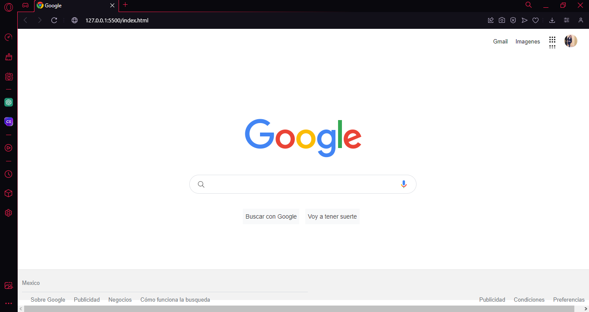

# clon-google
Proyecto de **Tecnolochicas pro** simulando la pagina principal del navegador de Google. 
******
Poniendo en practica lo aprendido en el bootcamp logre realizar un clon del explorador de google. 
##1. Intro 
El proyecto fue creado con **HTML y CSS**. Se trata de el navegaor mas usado. La interfaz de Google. 
* Puedes visitar el sitio de el siguiente enlace 

**Inspirate de la realizacion de este proyecto, utiliza tu destreza para demostrar que tu futuro es ser desarrolladora frontend **

##Contenido del proyecto 
1. Header
   Seccion que muestra el menu y foto del perfil 
2. Main
   Conteneedor de los elementos centrales 
3. Footer
   Incluye hipervinculos al final de la pagina

Realizado por Angeles Osorio 💜
